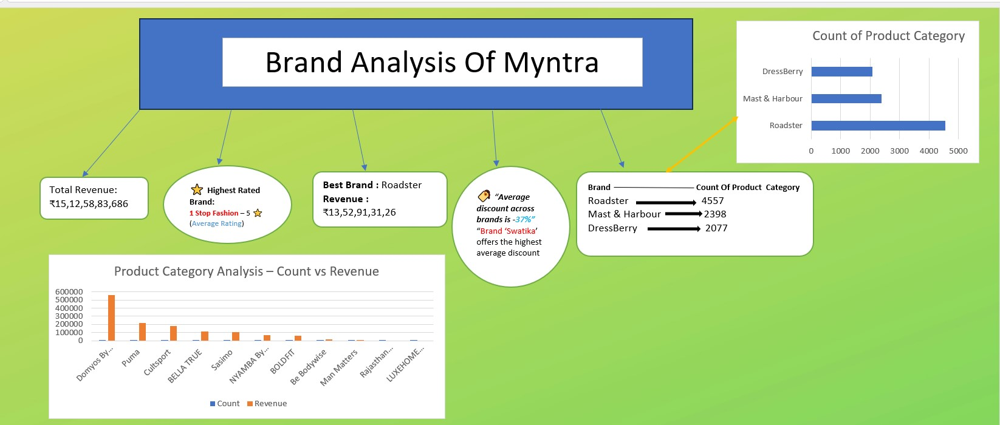

# Myntra Sales Analysis – Excel Dashboard Project

This project is an Excel-based analysis of a sample Myntra dataset 
containing product, brand, rating, and revenue information.

## Objectives:
- Identify high-performing brands based on the sum of revenue and average rating, and the sum of rating count.
- Analyse product distribution across categories
- Understand discounting patterns and pricing strategies
- Design a visually clean dashboard to communicate key insights

## Data Columns Used:
- Brand Name
- Product Category
- Rating & Rating Count
- Marked Price & Discounted Price
- Discount %
- Computed Revenue (Rating Count x Marked Price)

## Key Insights:
- Total Revenue across all products
- Top Brands by Revenue
- Highest Rated Brand
- Most Represented Product Categories
- Average Discounts across Brands
- Comparison of Revenue vs Product Count per Category

## Tools Used:
- Microsoft Excel
  - Pivot Tables
  - Conditional Formatting
  - Charting (Bar Charts, Pie Charts)
  - Manual Dashboard Layout for performance
  - Use Slicer for Product Category

**Dashboard Image**

